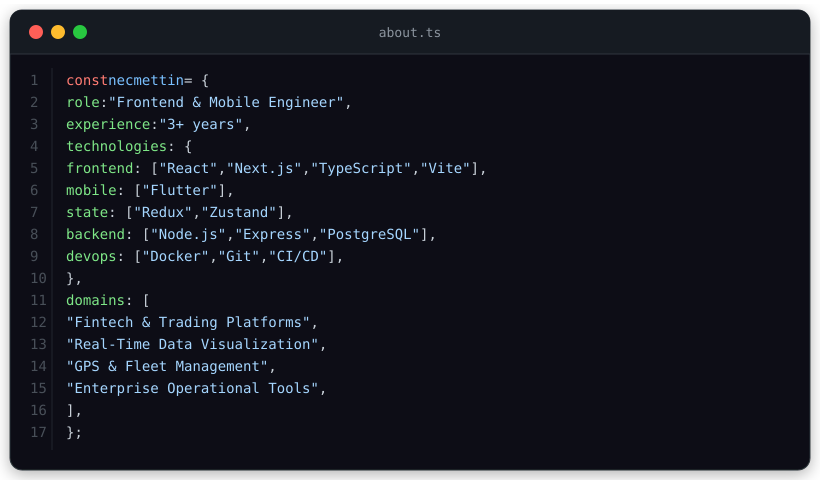

 

 

  <em>Building high-performance web & mobile applications with a passion for clean architecture and pixel-perfect interfaces.</em>

 

  

 

<h3 align="center">⚡ Core Technologies</h3>

<table>
  <tr>
    <td align="center" width="96">
      
       <strong>React</strong>
    </td>
    <td align="center" width="96">
      
       <strong>Next.js</strong>
    </td>
    <td align="center" width="96">
      
       <strong>TypeScript</strong>
    </td>
    <td align="center" width="96">
      
       <strong>JavaScript</strong>
    </td>
    <td align="center" width="96">
      
       <strong>Flutter</strong>
    </td>
    <td align="center" width="96">
      
       <strong>Vite</strong>
    </td>
  </tr>
  <tr>
    <td align="center" width="96">
      
       <strong>Redux</strong>
    </td>
    <td align="center" width="96">
      
       <strong>Node.js</strong>
    </td>
    <td align="center" width="96">
      
       <strong>Express</strong>
    </td>
    <td align="center" width="96">
      
       <strong>PostgreSQL</strong>
    </td>
    <td align="center" width="96">
      
       <strong>Docker</strong>
    </td>
    <td align="center" width="96">
      
       <strong>Git</strong>
    </td>
  </tr>
</table>

 

  

